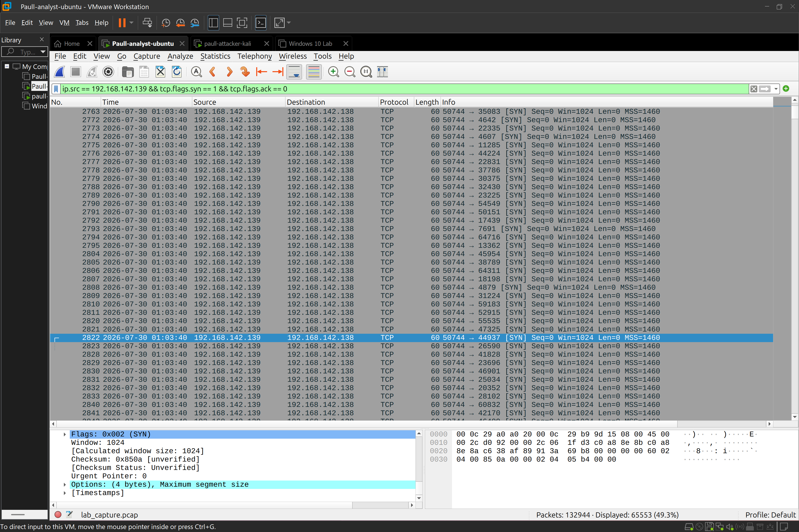
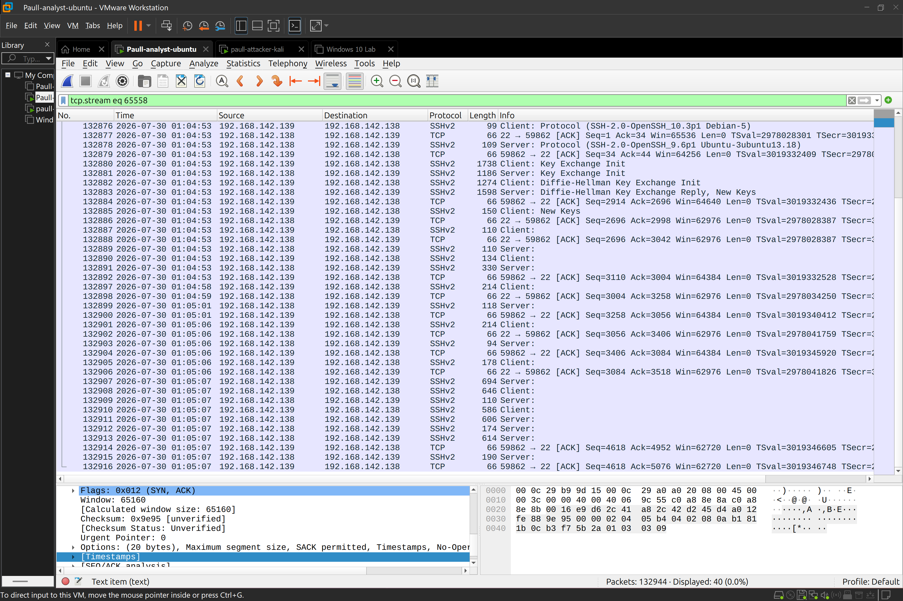
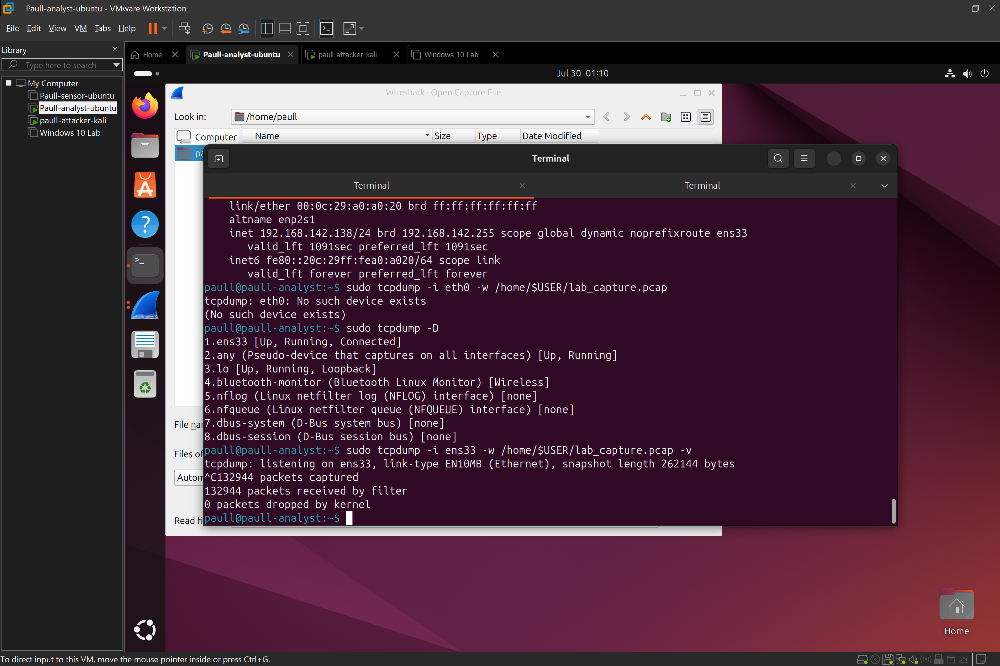

## Objective
The objective of this lab is to generate and analyze live attack traffic to understand reconnaissance and brute-force patterns at the network layer with ```WIRESHARK```, while also deeply understanding the correlation between SIEM generated logs, and host based log tools.

## Environment


|   Role   |   Machine    | Details |
| -------- | -------- | -------- |
|  Attacker | Kali Linux  | host my hydra, Nmap |
| Server / Client | Ubuntu OS |  SSH server created,  with Wireshark listening and generating Packet capture to detect brute-force & Nmap recon attempt |
| Network | VM-ware internal network (Host-only) |  Isolated lab environment |

## Steps Taken
1. Setup Wireshark on ubuntu, start wireshark, generate & forward pcap logs  - sudo tcpdump -i ens33 -w /home/$USER/lab_capture.pcap port 22
2. run an Nmap scan on Kali against the Ubuntu OS IP - nmap -sV -P- 192.168.142.139
3. run hydra brute-force against the SSH user created in ubuntu OS - hydra -l hrstaff1 -P wordlist.txt ssh://192.168.142.138

## Analysis
Reconnaissance detection: 
burst of multiple SYN handshake from IP ```192.168.142.139```  to my Ubuntu machine through the span of seconds, is highly suspicious, and serves as alert that an attack is underway
 

Brute-force detection:
all SSH attepmt by hydra was captured by wireshark, analysing these logs further revealed the attacker's IP addr. 





## IOC Table

| IOC Type | Value  | Context |
| -------- | -------- | -------- |
| Source IP  | 192.168.142.139 |  Scanning + brute-force origin |
| Target IP  | 192.168.142.138  | Victim host  |
| Target service | SSH (port 22) | Brute-force target |
| Ports Scanned | 4424,23831, .....| Some ports from NmapSYN scan |
| pattern | High volume SYN | This is indicative of port scan |
| Auth attempts | per previous lab count on auth.log- 28 | All 28 were present in the Pcap |

## Timeline

At 01:03:40 🕓, host 192.168.142.139 initiated a SYN scan against 192.168.142.138, sweeping ports 1-65535 over ~40 seconds. This was followed at 01:04:53 🕠 by repeated SSH authentication attempts against port 22, consistent with a Hydra dictionary attack. Correlation with /var/log/auth.log confirmed 26 failed login attempts before a successful authentication few seconds after.

## Key Takeaway
The purpose of this lab is to deeply understand the correlation between SIEM tools, and host log tools, pcap shows connections patterns on wireshark, while auth.log confirm the outcome,  A pcap + log correlation like this,  is standard and a much needed SOC triage methodology.

